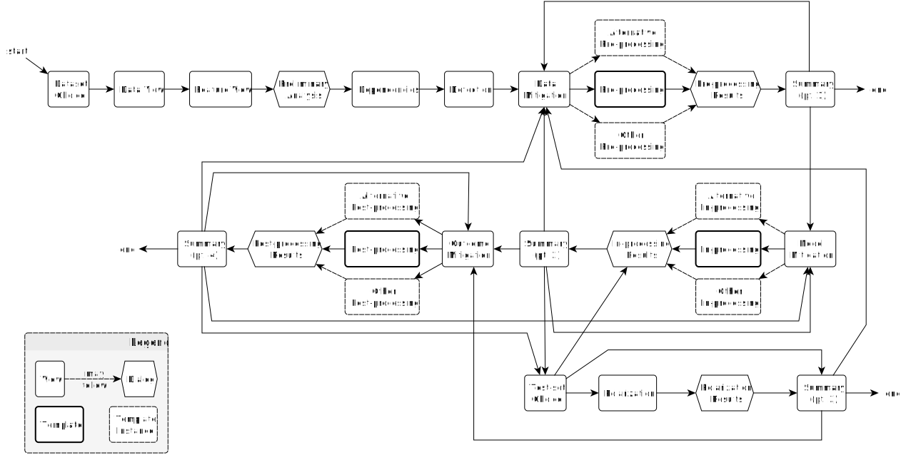
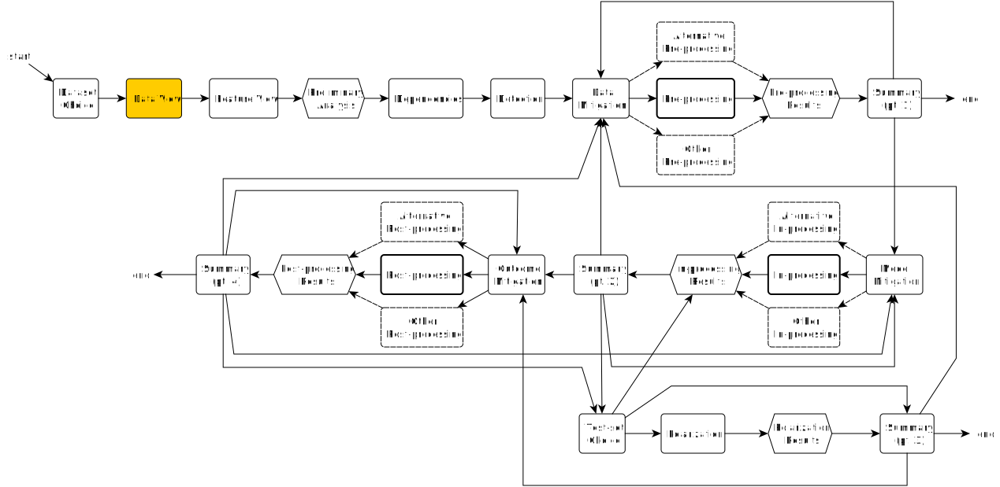
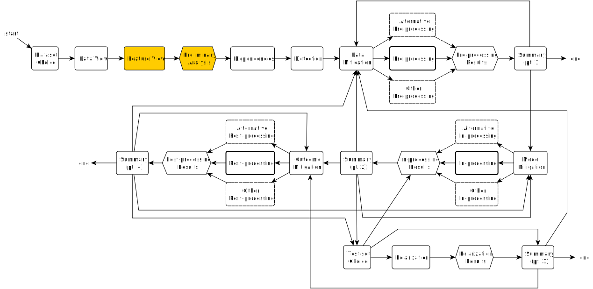
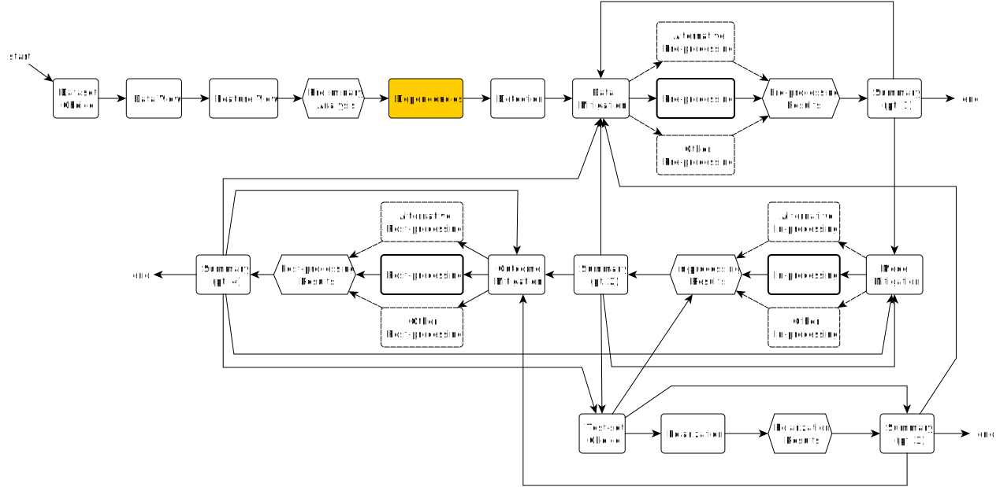
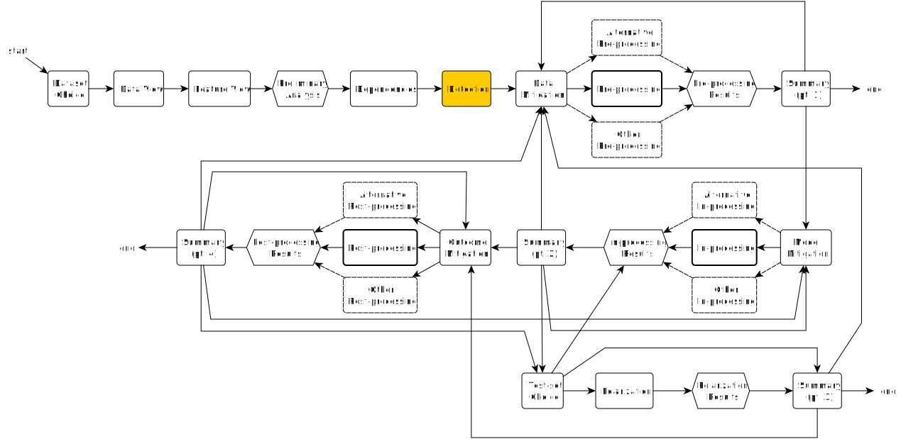
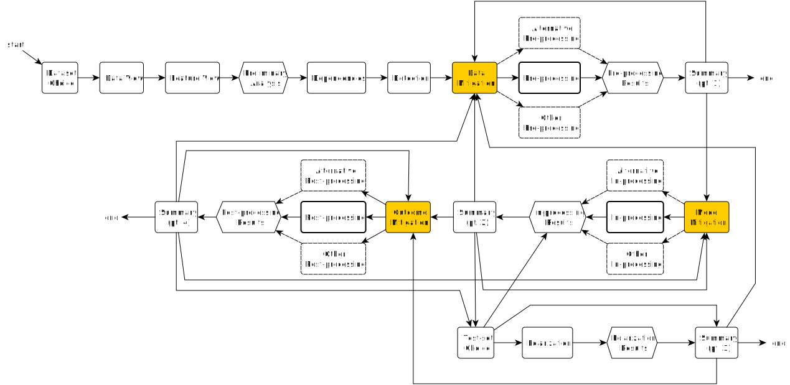
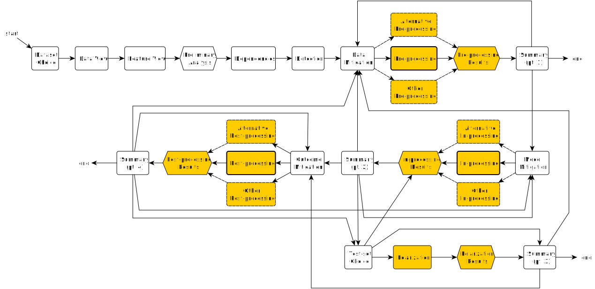
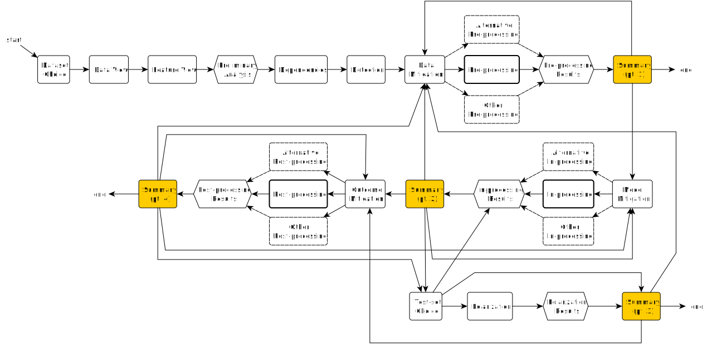

# AEQUITAS Experimenter UI
## Technical Requirements

### Overview

The AEQUITAS Experimenter UI is a Web application that allows users to create and manage AI-fairness experiments. 
Here we focus on the UI, that we assume to be a single page application (SPA) written in JavaScript.
The UI will be animated by a Web service exposing a ReSTful API.
Both the service and its API will be developed in parallel w.r.t. the UI.
UI developers may consider mocking the service and its API to speed up the development process.

The UI will essentially consist of a wizard that will guide the user through the process of training an AI model, 
while detecting and mitigating fairness issues. 
The wizard will consist of several views to be presented to the user.
In which order will view be presented to the user is up to the Web server to decide, at run-time, 
based on how the user interacts with the UI.

The following diagram provides an overview of the wizard's views and their possible transitions:

Overall, the wizard will encompass the following phases:

1. **Data Provisioning**: the user will provide a dataset to the system, along with an indication of
    - the data schema, e.g. names of the columns, their types, etc.
        + for the moment, we assume data to be tabular...
        + ... hence we use the terms 'column', 'feature', and 'variable' interchangeably
    - the target (a.k.a. output) variable(s), i.e. the variable to be predicted
    - the sensitive variable(s), i.e. the variable(s) that may lead to fairness issues (e.g. gender, race, etc.)
    - the protected values \[of the sensitive variable(s)\], i.e. the values that should not be discriminated against 
    (e.g. 'female' for 'gender', 'black' for 'race', etc.)
    - input features are detected automatically by the system (e.g. the columns which are non-target)

2. **Proxy Detection**: where the system will help the user to mark input, non-sensitive features as proxies for the sensitive ones
    - the system will suggest proxies based on the correlation between the input features and the sensitive ones
    - the user will be able to accept or reject the system's suggestions

3. **Bias Detection in the Data**: where the system will help the user to detect biases in the dataset
    - the system will let the user choose the bias detection metric to be used
        + e.g. disparate impact, statistical parity, etc.
    - the system will show charts and tables to help the user understand the biases in the dataset
    - the system will let the user select which situations to mitigate

4. **Data Mitigation** (a.k.a. pre-processing): where the system will help the user to mitigate biases in the dataset
    - the system will let the user choose the mitigation technique (a.k.a. pre-processing algorithm) to be used
        + e.g. reweighing, resampling, etc. (cf. [AIF360 doc](https://aif360.readthedocs.io/en/stable/modules/algorithms.html#module-aif360.algorithms.preprocessing))
    - the system will let the user provide the hyperparameters of the mitigation technique
    - the system will let the user decide when to start the algorithm
        + the algorithm will run on the server side
    - when the algorithm is done, the system will be able to inspect the pre-processed dataset, and possibly download it

5. **Model Mitigation**: where the system will help the user to train a fair AI model, or mitigate an existing one
    - the system will let the user choose the model to be used
        + e.g. adversarial debiasing, prejudice remover, etc. (cf. [AIF360 doc](https://aif360.readthedocs.io/en/stable/modules/algorithms.html#module-aif360.algorithms.inprocessing))
    - the system will let the user provide the hyperparameters of the algorithm
    - the system will let the user select the training dataset among the original one and the pre-processed one
    - the system will let the user decide when to start algorithm
        + the training will run on the server side
    - when the training is done, the system will be able to inspect the trained model, and possibly download it

6. **Outcome Mitigation**: where the system will help to patch the model's predictions
    - the system will let the user choose the outcome mitigation technique to be used
        + e.g. post-processing, etc. (cf. [AIF360 doc](https://aif360.readthedocs.io/en/stable/modules/algorithms.html#module-aif360.algorithms.postprocessing))
    - the system will let the user provide the hyperparameters of the technique
    - the system will let the user select the model to be patched
    - the system will let the user decide when to start the algorithm
        + the algorithm will run on the server side
    - when the algorithm is done, the system will be able to inspect the patched model, and possibly download it

7. **Model Evaluation**: where the system will help the user to evaluate the fairness of the model
    - the system will let the user upload or select a test dataset
    - the system will allow the user to polarise the test dataset for the sake of stress-testing the model
    - the system will let the user choose the evaluation and fairness metrics to be used
        + e.g. accuracy, precision, recall, F1, etc.
    - the system will show charts and tables to help the user understand the model's performance

> Notice that the phases are not necessarily linear, and the user may jump back and forth between them.

### Views Description

Here we provide a graphical description of the views that the wizard will encompass.

Each view should be implemented as a reusable template, where the actual content is injected at run-time.
Which content is injectable and which is static in each view depends on the view itself.
The actual content to be injected will be provided by the Web service, upon transitioning from one view to another.
Each view will also come with an indication of which controls are available to the user in that view.
In this way, when a view must collect inputs from the user, the UI knows which values to send to the Web service.

In the following, we delve into the details of each view.

#### Dataset Choice and Test-set Choice Views

A view for dataset provisioning.
Dataset can be uploaded or selected from a list of available datasets.

##### What 

##### Where 

##### Parameters for view instantiation

- The list of datasets will be provided by the Web service, and these should appear as new entries in the list

##### Data to be collected by the view

- Either the file uploaded by the user
- or the dataset selected by the user
- pressure on the 'Next' button

#### Data View 

A view for dataset inspection (mostly focussing on the rows of the dataset).

##### What

##### Where

##### Parameters for view instantiation

- Rows of the dataset will be provided by the Web service,
- as well as columns
- and the whole dataset should appear as a table in the view

##### Data to be collected by the view

- pressure on the 'Next' button

#### Features View

A view for dataset inspection (mostly focussing on the schema of the dataset).
This is where the user specifies the target and sensitive features.

The view comes with a pop-up dialog giving insights about the data distribution of each feature,
upon request.
The dialog allows choosing among different types of charts (e.g. histograms, pie charts, etc.).

##### What

##### Where

##### Parameters for view instantiation

- Columns of the dataset will be provided by the Web service,
- schema information about each feature (e.g. type, value range, etc.)
- statistics about the data distribution of each feature (e.g. mean, median, mode, etc.)
- \[in case chart generation does not occur on the client side\] pictures of the charts

##### Data to be collected by the view

- what feature IDs are marked as target
- what feature IDs are marked as sensitive
- pressure on the 'Next' button

#### Dependencies View

A view for dataset inspection (mostly focussing on the dependencies between the features).
This is where the user specifies the proxies for the sensitive features.

##### What

##### Where

##### Parameters for view instantiation

- Correlation matrix of the dataset will be provided by the Web service,
- as well as other charts, such as functional dependencies graphs, etc.
- a tree of sensitive features and their mostly correlated features is provided too

##### Data to be collected by the view

- what feature IDs are marked as proxies for each sensitive feature
- pressure on the 'Next' button

#### Detection View

A view for dataset inspection (mostly focussing on fairness metrics).
This is where the user specifies which biases to address in subsequent phases.

##### What

##### Where

##### Parameters for view instantiation

- Fairness metrics names and acronyms will be provided by the Web service,
- along with the names of the sensitive features (as inserted by the user in previous views),
- and the values of each fairness metric for each sensitive feature, w.r.t. the output features
- \[in case chart generation does not occur on the client side\] pictures of the charts

##### Data to be collected by the view

- which sensitive features are selected for mitigation, for each fairness metric
- pressure on the 'Next' button

#### Mitigation View

A view for choosing which (dataset, model, or outcome) mitigation technique to apply.
This can be customised by the Web service, in order to serve the pre-, in-, and post-processing algorithm case.

##### What

##### Where

##### Parameters for view instantiation

- Pre-processing algorithms names and acronyms will be provided by the Web service
- Whether it is a pre-, in-, or post-processing algorithm (the value of `X` in the picture)

##### Data to be collected by the view

- which algorithm is selected
- pressure on the 'Next' button

#### Pre-, In-, and Post-processing View

A view for running a processing algorithm.
This is a highly customisable view template which could be adapted to the needs of the specific algorithm.
Customization occurs via the Web service, which provides the necessary parameters for the view
This should serve pre-, in-, and post-processing algorithms.
All such algorithms have hyperparameters that the user can set,
but they differ from algorithm to algorithm.

The view includes a progress bar, hidden by default, to notify the user that the algorithm is running.
(No need to show actual progress, just a spinner or a progress bar that runs indefinitely.)

Once the algorithm is done, a 'Results' button appears, which the user can press to inspect the results of the algorithm.
Results can be charts, tables, or other types of data.
From that dialog, the user can also download the outcome of the algorithm.

> The 'Polarization' view is indeed yet another instance of this view, but with a different name.
> The reason being: polarization is technically yet another pre-processing algorithm, with a different goal:
> adding bias rather than removing it.

##### What

##### Where

##### Parameters for view instantiation

- The Web service will provide the hyperparameters (names, data type, and admissible values) of the algorithm
    + these should be rendered according to the most adequate input control for the data type
    + this may include field for file upload if the algorithm requiers input files
        * this is the case, e.g., for in-processing algorithms which operate on pre-trained models

##### Data to be collected by the view

- values for all the aforementioned hyperparameters
- pressure on the 'Run' button
- pressure on the 'Next' button

#### Summary Views

A view aimed at summarising the operations performed so far.
In particular, it shows a graph depicting all the datasets and the models created/provided so far,
and how they are related to each other.

The view also shows buttons 

##### What

##### Where

##### Parameters for view instantiation

- Textual information about the datasets and models created/provided so far
- and their relationships
- plus which buttons to show/hide (hence enabling/disabling going back to previous views)

##### Data to be collected by the view

- pressure on the buttons

### Technical Desiderata

- The UI will be a SPA written in JavaScript
- Therefore UI will consist of a Node project, and possibly rely on a framework like React, Angular, or Vue
- Framework preferences (descending): __Vue__ > React > Angular
- When views contain charts, charts should be generated client-side
    * if this is too complex, the Web service may provide pictures of the charts instead 
    (so the UI must simply display pictures which are dynamically provided)
- The Web service can be mocked by developers arbitrary, but the UI should be designed to 
    1. receive 'Parameters for view instantiation' from the Web service and use them to render each view
    2. send 'Data to be collected by the view' to the Web service upon transitioning to another view
